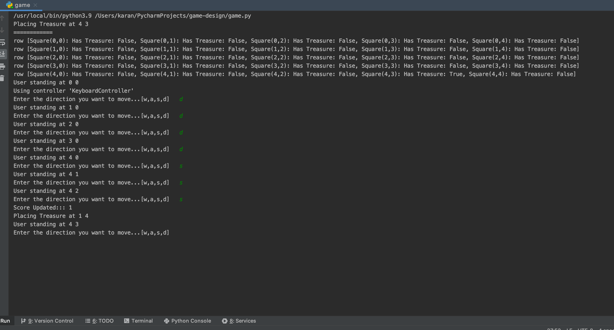

#Find that bone!!

## System requirement
- python3+


## How to run?
```bash
$python game.py
``` 

### Notes

- Move the player with "W-A-S-D" keys
- Allows switching of movement controller at run time
- When a player lands on the treasure, score is updated and treasure is removed from square block and randomly assigned to other block
- Has checks for player to not go out of bounds of board
- Movement: Controller Class fires the event to parent instance, which  in turn checks if person is allowed to move. If the person is allowed to move, the board state and square values changes and some. Every movement checks if player has found the treasure
- Can be extended to allow multi player (Not in scope)
 
## Demo 
